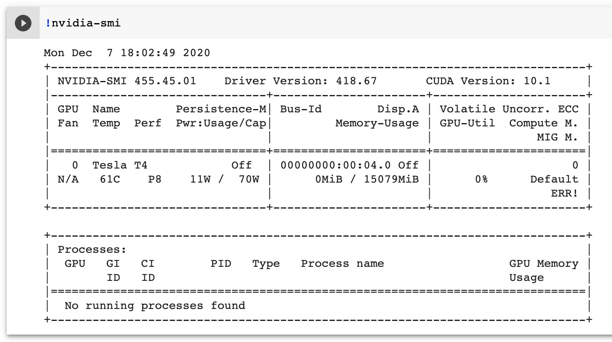
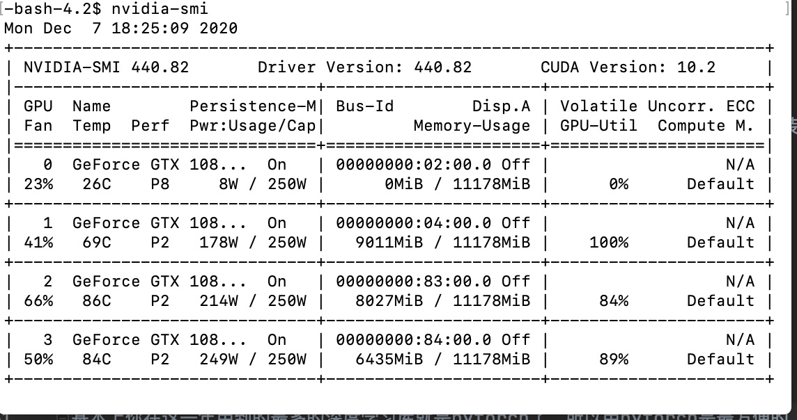
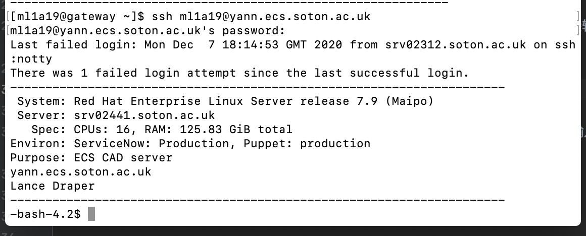
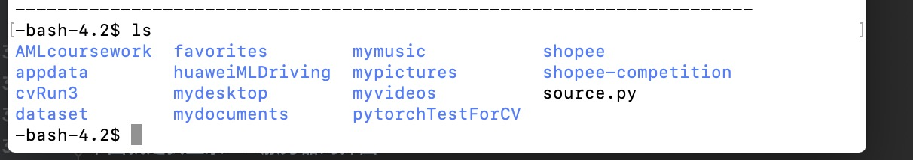
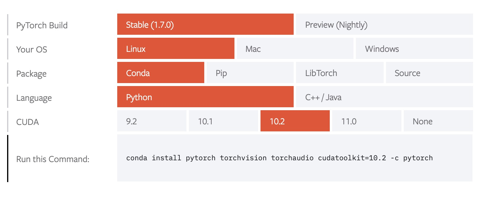
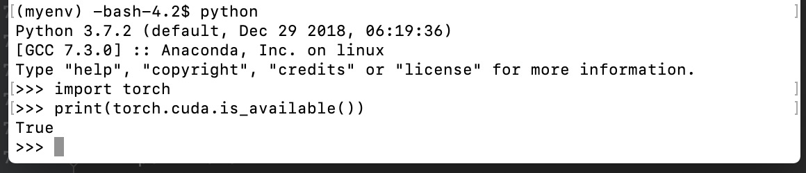

# GPU加速

## 介绍
在学到advance machine learning, deep learning 以及computer vision(最后一个大作业)的时候，我们很多时候是需要用GPU加速的💻。但是如果你的laptop是mac或者是超极本，那肯定不可能用自己的本本开GPU加速的。这个时候，有两种方式可以解决。

## Colab
[Colab](https://colab.research.google.com)。不得不说，这个是你以后的首选，尤其是喜欢Jupyter notebook的童鞋会特别中意这个在线版notebook，还自带代码补全。正常情况下分到的显卡是k3,但是你可以通过不断的回复出厂设置，来随机刷新更好的显卡。

输入:

```
!nvidia-smi
```
你就可以看到当前分配的显卡是什么。比如下图中我分到的是 Tesla T4 专业卡。这个显卡跑课程需要的内容完全是绰绰有余的了。



## 远程桌面
这个方式是连接学院的windows下的 RTX 2070的显卡。因为我自己没有使用过，只能先push一个学院的网址，大家根据上面的自己试一试。 [地址](https://knowledgenow.soton.ac.uk/Articles/KB0020338)

## SSH连接四路1080TI
这个是我比较熟悉的方式。也是我可以跟大家仔细讲的内容。但是因为服务器是Linux系统，所以需要你有一定的Linux基础。不过不用担心，我可以带你学习一遍简单的Linux命令。🗿


### 准备你的ssh工具
Mac和Linux电脑的终端自带ssh功能，所以比较方便。因为我自己用的是Mac，所以我就直接跳过SSH安装的过程。用Window的童鞋需要自己先下载一下噢。

### 连接ECS服务器
首先，如果你是学校内网童鞋(包括学校的宿舍，如五月花，学校图书馆),你可以终端直接输入。其中ml1a19是我的学号🐶你们根据自己的进行调整。然后输入账户密码
```
ssh ml1a19@yann.ecs.soton.ac.uk    //非内网账户直接输入这个是无效的噢
```
注意，如果你不是学校内网的用户，你得先输入以下命令，进入学校的内网环境，然后再输入上面的命令，才能进入到ECS学院服务器的环境🌝
```
ssh ml1a19@ssh.soton.ac.uk
```
下图就是我登录ECS服务器的界面



### 创建一个虚拟的环境
进入了服务器之后，不熟悉Linux命令的童鞋可以直接输入```ls```, 这个命令是list，就是把当前文件目录下的所有文件list下来。可以看到我的根目录其实还是挺乱的。


接下来的一步及时创建一个新的虚拟环境
```
conda create -n your_env_name python=X.X（2.7、3.6等)
```
比如
```
conda create -n myenv python=3.8  //创建myenv虚拟环境
```
系统是自带conda的，conda这个包管理工具可以帮你管理安装你所安装的包，你以后安装的所有包都只会在myenv这个虚拟的环境下。这样做的好处就是让你的环境与系统隔离。

当你创建好myenv之后，你别忘了激活它。
``` 
conda activate myenv   // 激活
```
以后你每一次登录之后的，都需要激活一下这个虚拟环境

### 安装pytorch
基本上你在这一年用到的最多的深度学习库就是pytorch了，所以用pytorch是最方便的,当然Jon认为pytorch是学术界的主流，所以你们基本上用不到tensorflow了。

在这里，你们可以先去[pytorch的官网](https://pytorch.org/get-started/locally/)去选择相应的环境。如下图所示。我因为力求稳定，CUDA选的是10.2。你们可以试试11.0.


然后在你的myenv环境下输入:
```
conda install pytorch torchvision torchaudio cudatoolkit=10.2 -c pytorch
```
就等待安装好了。

### 查看是否安装成功以及是否支持GPU
首先输入```python```,进入到python终端，然后分别输入

```import torch```
```print(torch.cuda.is_available())```




## 如何把自己的项目放在服务器
这里推荐就是大家把自己的项目放在github上，然后直接通过Linux终端git pull下你的项目，然后进行跑代码。


## 不建议四路1080ti全开
虽然pytorch支持多GPU训练，但是学院的四路1080ti只有一台，所以我不建议大家多开GPU。如果实在是显存需要太大，也最后凌晨的时候开个两到三个。我自己有过四路全开的方式，被好朋友发现，然后尴尬的关掉了😂。

为了杜绝大家这么做，你们可以用以下方式去检查谁用了四路1080ti。

首先输入```nvidia-smi```查看哪些pid正在多GPU跑代码。然后在终端输入```top```，就可以知道USER的学号是什么，比如我的是ml1a19。。然后你发邮件给他，提醒他不要多开。

最后，你所要做的就是去学习pytorch(虽然Jon会通过实验的方式带大家学习pytorch)。当然，在这里，我会给大家一些推荐资料。


## 资料
1. [莫烦 pytorch教程](https://mofanpy.com/tutorials/machine-learning/torch/)。莫烦的pytorch教学应该是我看过的最好的pytorch教学视频。可惜的是，他用的pytorch版本比较低了，所以我建议你不用跟着敲代码，你就把很多知识点跟着过一遍，学习理论。
2. [pytorch官方教程](https://pytorch.org/tutorials/beginner/transfer_learning_tutorial.html)。这个是pytorch官方的迁移学习教程，用做分类的。划重点，这个是cv最后的大作业会用到的噢。当然如果你选择用[fastai](https://www.fast.ai/)偷懒也行。


